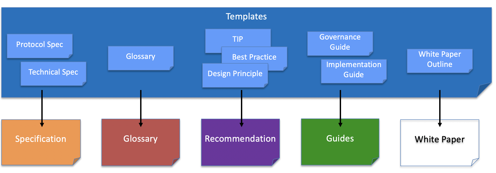
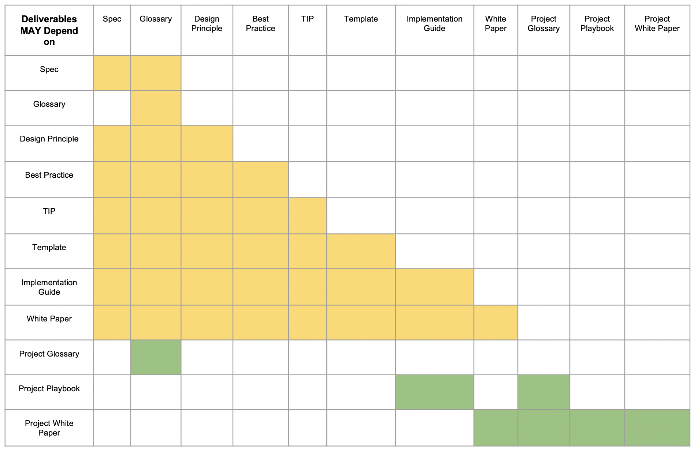
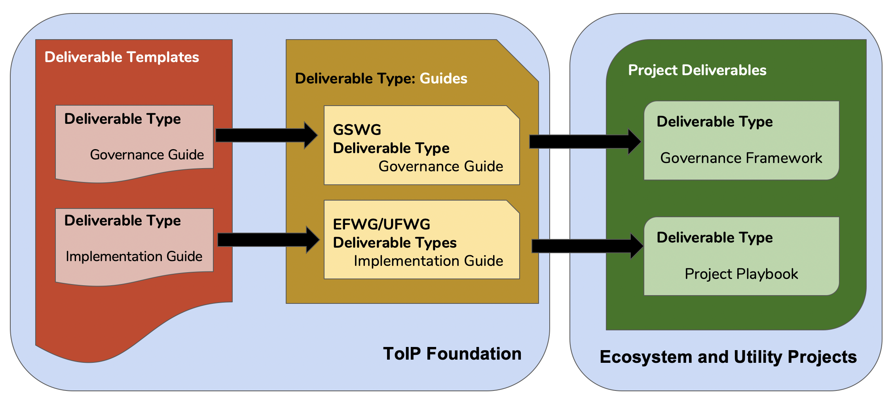

## Content Consistency
Since there will be a variety of instances for each type of ToIP Deliverable, contributors within the ToIP Foundation should be bale to benefit from the experience of prior work.

A **template** is a document model that provides common reusable outline for all deliverable types to improves consumability, consistent and productivity.

Each deliverable type has an associated template that can be copied to *instantiate* new instances of a deliverable type.

The ToIP Foundation uses [the Markdown language](https://www.markdownguide.org/) to create deliverable templates. These files are designed for writing documentation in plain text that can be easily converted to PDF, HTML and other formats. Templates use the ".md" file extensions.

Templates enable the ToIP community to quickly leverage lessons learned by others to get started on the publishing of a ToIP Deliverable.



Figure 1 provides a simplified view of the more detailed [UML Class Diagram](../_images/process/class_diagram.png) that depicts the relationship of Templates to ToIP Deliverables.

Templates are managed in the ```templates``` folder of the [deliverables repo](https://github.com/trustoverip/deliverables).

## Deliverable Type Usage
While not intended as an exhaustive information source the following table helps to describe the relationships of how various deliverables may be used by other deliverables.



The ```YELLOW``` shaded cells reflect work-products of the ToIP Foundation, whereas the ```GREEN``` shaded cells reflect work-products of external foundry projects that have leveraged guidance from the ToIP Foundation.

For example, Ecosystem and Utility projects may leverage different guidance from different ToIP Work Groups.



Each external project may create its own Governance Framework and a Project Playbook to implement the domain specific project. So effectively, ToIP Work Groups USE templates to PRODUCE deliverables such as Guides. While external projects CONSUME Guides to PRODUCE Governance Frameworks and Playbooks.
