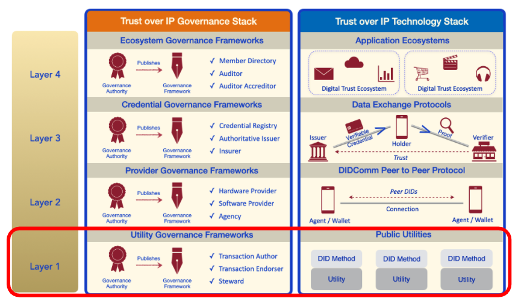
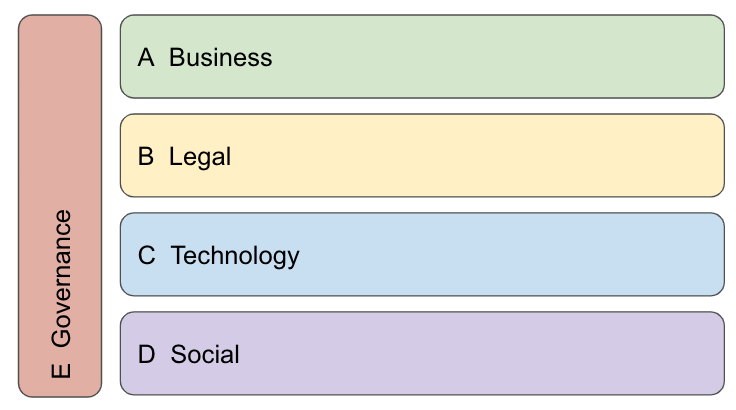
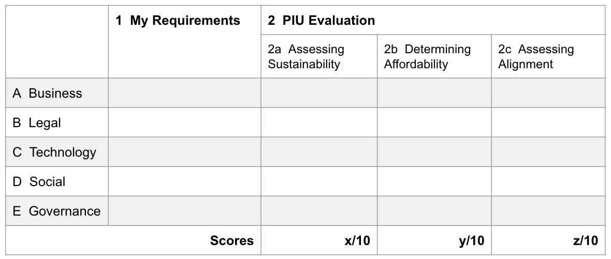
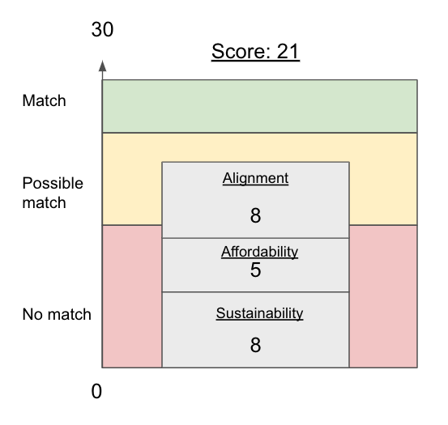

# BP0014: Utility Evaluation Framework
- Authors: [Mathieu Glaude](mathieu@northernblock.ca), [Dan Gisolfi](dan.gisolfi@gmail.com)
- Deliverable Type: *Recommendation - Best Practice*
- Status: [PROPOSED](https://trustoverip.github.io/deliverables/process/lifecycle_management/#proposed)
- Since: 2020-12-09 (date you submit your PR)
- Status Note: *Work-in-progress*
- Supersedes: NA
- Start Date: 2020-12-09
- Tags: #ufwg, #recommendation

## Summary
The objective of this document is to provide guidance on how to evaluate existing *Public Identity Utilities (PIU)*. For the purpose of this document, we will solely focus on blockchain-based public identity utilities. The main purpose of the framework described is to guide organizations who want to operationalize the Trust over IP stack to choose the best possible PIU that is aligned to their needs.

## Motivation
Who will get value from this framework:

- Organizations/Ecosystems who want to evaluate an existing public identity utility using a framework to project the highest ROI and minimized risks.
- Organizations/Ecosystems interested in convening a new public identity utility to have a framework to evaluate what is out there today and what market gap their utility can fill.

## Introduction to Public Identity Utilities (PIU)
The core purpose of every Public Identity Utility (PIU) is to offer a mechanism to achieve verifiability of data, by assuring the provenance and fidelity of specific data items is stored immutably on a blockchain.

The PIU is the foundation of the Trust over IP stack, providing a root of trust for decentralized ecosystem solutions to thrive.

This best practice document is the result of multiple interviews that were conducted with utility project conveners in October 2020. We spoke with conveners and participants of these following PIUs.

* [Sovrin](https://github.com/trustoverip/utility-foundry-wg/blob/master/workflow/stories/sovrin.md): The Sovrin Foundation is a nonprofit organization established to administer the Governance Framework governing the Sovrin Network, a decentralized global public network enabling self-sovereign identity on the internet. Sovrin’ mission is to give every person, organization, and thing the ability to own and control their own permanent digital identity.
* [Bedrock](https://github.com/trustoverip/utility-foundry-wg/blob/master/workflow/stories/bbu.md): The Bedrock Consortium is a collection of international private sector companies that operate the Bedrock Business Utility (BBU), an independent self-governed non-profit legal entity that serves as a public identity utility. The BBU is intended to serve organizations that desire to participate in digital trust ecosystems and require an enterprise grade governance framework.
* [IDUnion](https://github.com/trustoverip/utility-foundry-wg/blob/master/workflow/stories/IDunion.md): The IDunion consortium (formally known as SSI for Germany) is a public private partnership of companies and institutions, which implement and govern the IDunion utility. The IDunion utility is intended to serve organizations that desire to participate in the digital trust ecosystem and require an enterprise grade governance framework
* [uPort](https://github.com/trustoverip/utility-foundry-wg/blob/master/workflow/stories/uport.md): Unlike most active utility projects, uPort believes in permissionless ledgers and uses Ethereum as their PIU.
* [Indicio.tech](https://github.com/trustoverip/utility-foundry-wg/blob/master/workflow/stories/indicio.md): Indicio.tech was created to fill a need in the SSI community. Indicio's mission is to provide the professional services needed to build decentralized identity products.

## Defining Your Ecosystem Solution Requirements
In creating business cases around technology, people often use a simple framework of Business, Legal and Technology as being areas of which to use within business decisioning processes.

| Requirement | Description|
| --- | --- |
| Business | The critical activities of an enterprise that must be performed to meet the organizational objective(s) while remaining solution independent.|
| Legal | Any compliance requirements placed on an ecosystem or participants within the ecosystem that pertain to a range of laws such as financial regulations, tax obligations, and privacy  regulation.|
| Technology | The range of technical issues that must be addressed to successfully complete a PUI project. These include but are not limited to performance, reliability, and availability.|

A common mistake innovators should try to avoid is to start with technology requirements, before considering the business and legal requirements. There’s also some missing elements to this framework when dealing with a decentralized stack.

With decentralized stacks such as the Trust over IP one, it’s important to take two further elements into consideration.

| Requirement | Description|
| --- | --- |
| Social | It’s important for my ecosystem to create value for the society and also generate income (if not wealth). Our solutions must be innovative, unique, people and environment friendly. Examples of social requirements can include transparency, inclusivity, diversity and accessibility.|
| Governance | The collection of governing processes required by the PUI to be successful and sustainable. |

As an innovator looking to transform their ecosystem using the ToIP stack, you want to start off by defining what is important in each one of these categories based on your respective needs. [In a future exploration, we will create a list of questions under each one of these areas]

These are not only the categories you want to use to evaluate your own project requirements, but also to evaluate existing PIUs features.

## Evaluating a PIU Using 3 Best Practices

An innovator must conduct research on an existing PIU based on the same factors that they evaluated their own project requirements. Luckily we have started this process for you by documenting the [stories of various PUI projects here](https://github.com/trustoverip/utility-foundry-wg/tree/master/workflow/stories).

Once you do this, you should be capable of having this table below filled out for comparison purposes. This is the first piece of due diligence. If there is no synergy between your requirements and the offering from the PIU, you will need to look for other options.

1. Assessing Sustainability of a PIU: How will a particular PUI deploy a business model that will ensure long-term operational success. Please refer to our [best practice for assessing utility sustainability](../BP0015-assessing-utility-sustainability/BP0015-assessing-utility-sustainability.md).
2. Determining Affordability of a PIU: What budgetary and cost  questions should be considered when evaluating a PUI? Please refer to our [best practice for determining utility affordability](../BP0016-determining-utility-affordability/BP0016-determining-utility-affordability.md).
3. Assessing Alignment to a PIU: description. How to evaluate the alignment of a specific PUI against your ecosystems goals and objectives. Please refer to our [best practice for assessing utility alignment](../BP0017-assessing-utility-alignment/BP0017-assessing-utility-alignment.md).

## Making a Decision
From the previous table, you should be able to total the scores to see if there’s a fit or not. We’re using two different measures here:

* Cumulative: ToIP can recommend a minimum totaled threshold;
* Individual minimums: Individual assessors can set their own thresholds by metric.

If you don’t meet the thresholds, you may want to keep exploring for other projects or you may want to consider convening your own project.

## To-Do Items

1. Socialize this within ToIP organization;
2. Continue research on utility projects;
3. Create v1 documents of 3 Best Practices listed above.
